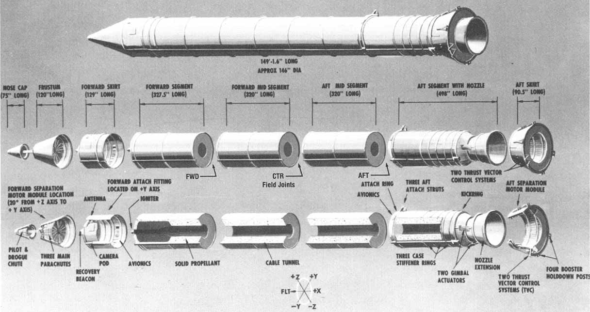

# 25th Anniversary of Hubble Telescope

On April 24th, 1990 the space shuttle named Discovery set off from the Kennedy Space Center which carried an astromical observatory known as the Hubble Space Telesopce.  We just recently celebrated the 25th anniversary of the "Crown Jewel" of NASA.  These past 25 years, [Hubble](http://hubblesite.org/) has advanced our understanding of Cosmology, Galactic and Planatery science.  It has helped answered many astronomical questions we had as well as bring to light new mysteries that we didn't knew existed.  [Pillars of Creation](http://en.wikipedia.org/wiki/Pillars_of_Creation) (shown below) is an example of the beauty and sheer awesome of what is out there in space.  And to think, in 2018 NASA will be launching a new [telescope](http://en.wikipedia.org/wiki/James_Webb_Space_Telescope) that is 100 times more powerful than Hubble and will be able to look back 13.5 billion years in the past!  We're lucky the House of Representiatives in 2011 didn't get their way and kill the program when it was 75% complete.


```{r results='asis', fig.width=9, fig.height=3, echo=FALSE }
library(png)
library(grid)
img <- readPNG("~/Documents/LaGuardia.github.io/images/hubblepic.png")
grid.raster(img)
```


These past couple of weeks, I've been on a big Space kick.  Europa Report, which can be streamed on Netflix, had me obsessing over space travel and exploration.  The recent coverage on the [NASA twin study](https://www.nasa.gov/content/twins-study/#.VUGkIq1Viko) as well as celebrating Hubble's 25th year have also been fueling the fire. [Science Friday](http://sciencefriday.com), a radio talk show on NPR, featured many segments dedicated to space and NASA this past Friday.  After listening to the show, I began thinking of when I first fell in love with Space, and in turn, Science.  Like most people, it occured at a young age, but instead of the allure of adventure and just looking cool in a space suit, it was the tragic accident of the Challenger Space shuttle.  

I was too young for the event that many children and adults actually witnessed live, but my primary school, Christa McAullife Elementary, named after the school teacher that was part of the crew.  Because of this, I was exposed to the events that occured.  These events are the main story of this post.

# January 26th, 1986

The temperature at 11:38am EST at Kennedy Space Center in Cape Canaveral, Florida was 36 degrees Fahrenheit.  An unusually cold day for Florida, but the flight was delayed already a couple of hours as well as 4 days due to many problems.  At that moment, NASA's space shuttle Challenger broke apart just seventy three seconds after its take off and took the lives of seven American astronauts. It wasn't until almost three years later that NASA continued the shuttle program.


# What Happened?

After the accident there was a Presidential commission formed to find and explain the resasons for the disaster.  They came to the conclusion that the explosion was caused by "a failure in the joint between the two lower segments of the right Solid Rocket Motor."  The seals that are intended to prevent hot gases from leaking through the joint during the initial burn of the rocket motor.  These seals are called O-rings




For some background, When liftoff, the space shuttle uses two booster rockets to lift into orbit.  These boosters are sealed at certain joints with rubber O-rings.  Their main role is preventing the release of hot gases produced during production.  Each booster has uses 3 primary O-rings for a total of 6 for each flight.  A potential fear that engineers had the night before the flight was O-ring failure at low temperatures.  The forecast for the flight was 31 degrees fahrenheit, but their conclusion was there wasn't enough evidence of concern to add more delay to the flight.  No flight before had serious consequences.

Before the Challenger flight, there was 24 previous flights with the same design for boosters.  Of the 24, NASA was able to save and collect the data for 23 of the previous flights (Hardware was lost at sea for one flight).


# Studying O-rings

The Challenger O-rings have been studied and used as examples for multiple disciples for years.  There are many complete case studies available on this problem.  My main goal in writing this post is to utilize and show off Rstudio's ability to display data and show my analysis.  This is part me learning how to use certain features that have become recently available and part me working through the Challenger O-ring problem.  Since this is my first post, I hope to learn from this example problem and use the same techniques for current problems, such as Kaggle data competitions.

## Data Display
Here is the data I will use for analysis in table form as well as an interactive graph using Plotly.  This example probably doesn't do justice to these two tools, but its easy to see their usefulness. 

```{r,echo=FALSE,message=FALSE, plotly=TRUE}
orings<-read.table("orings.txt",header=TRUE)
orings$Date<-as.Date(orings$Date,"%m/%d/%Y")
colnames(orings)<- c("row","Date","Temperature","Damaged","orings")
oring<-orings[,c(2,3,4)]
oring$failure <-ifelse(oring$Damaged > 0,1,0)
prop<-oring$Damaged/6

library(DT)
library(plotly)
datatable(oring, options = list(iDisplayLength = 5),rownames = FALSE,
          caption = 'Table 1: Simple list of Challenger Data')

py <- plotly(username="LaGuardia", key="5i2jxsaljy")  # open plotly connection
gg <- ggplot(oring) + geom_point(aes(Date, Temperature),alpha=1/4)  +
  ggtitle("Temperature at Challenger Liftoffs") + theme_bw()

gh <- ggplot(oring,aes(Temperature,failure)) + geom_point(alpha=1/2) + ylab("Proportion damaged") +
  ggtitle("Scatterplot of Damaged O-rings and Temp") + theme_bw()

py$ggplotly(gh,session="knitr",kwargs=list(filename="orings1_knitr",
                                             fileopt="overwrite"))
#py$ggplotly(gg,session="knitr",kwargs=list(filename="orings_knitr",
 #                                            fileopt="overwrite"))

#library(sjPlot)
#sjt.frq(oring$Damaged)
#library(dygraphs)
#dygraph(oring, main = "Temperatures during Liftoff") %>% 
#  dyRangeSelector(dateWindow = c("1981-04-12", "1986-01-01"))
```

If you limit yourself to looking at flights that only had a failure (which you can do with the interactive graph), you might conclude no real relationship with failure and temperature, but if you include flights with zero incidents, there seems to be a clear relationship that the colder it is, the more likely a failure occurs.  The unusual observation (the failure at temperature 75) differed from the other flights in that it suffered only “blow–by” (where hot gases rush past the O-ring), while in all of the other flights damaged O-rings suffered “erosion” (where the O-rings burn up), as well as possible blow–by. If you don't include this observation, the trend is even more stark.  For now, lets leave it in.

## Could it have been prevented?

We don't know for sure if the temperature would have been warmer that the accident would not have occured, but with knowledge that the engineers had the night before on the relationship with Temperature and flights with O-ring failure, there should have been a strong case put forward to delay the flight again.

As in most problems, there doesn't seem to be  clear cut temperature that induces o-ring failure, but we can use a statistical model that gets to answering the question "At temperature $x$, what is the probability of having an o-ring failure?"  

A very common model used when modeling a dichotmous outcome (o-ring failure yes/no) is the logistic regression model.

$$ F(x) =  \frac{1}{1 + e^{-(\beta_{0} + \beta_{1}x) }} $$

$F(X)$ is the probability that a flight had an o-ring failure and x, in this case, is temperature. $\beta_{0}$ and $\beta_{1}$ are obtained by maximum likelihood estimation.


